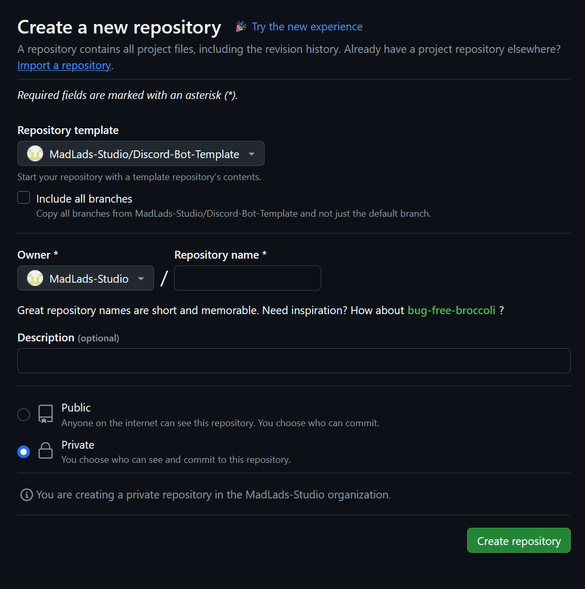
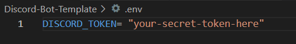
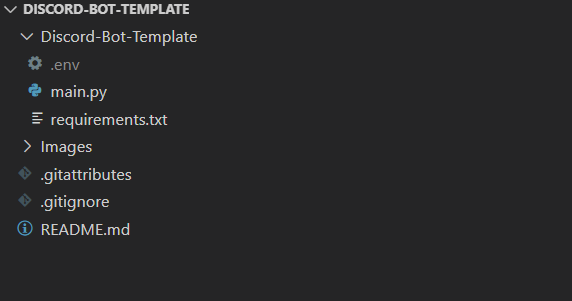

<h1 align="center"> Discord-Bot-Template </h1>
Bot Template in Python

## Getting Started

### 🧰 Requirements

- Python 3.10+
- [Discord Developer Account](https://discord.com/developers/)
- A bot token stored in a `.env` file:

### 📦 Creating New Repository

1. Click on **Use This Template**



2. Create a .env file in the root directory with your bot token:



- The directory should look like this in your prefered IDE:



3. Open the terminal and install dependencies in the **Discord-Bot-Template** folder:
```bash
pip install -r ./requirements.txt
```
4. Run the bot:
```bash
python main.py
```
## Resources
- [Discord.Py GitHub](https://github.com/Rapptz/discord.py)
- [Discord.Py Documentation](https://discordpy.readthedocs.io/en/stable/)
- [Discord for Developers](https://discord.com/developers/)
